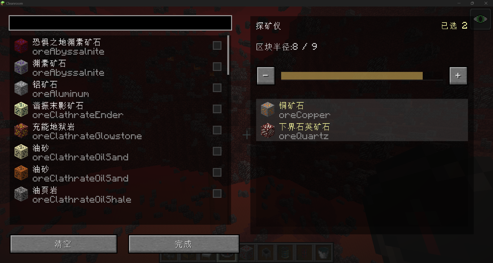

# BlockXray-1.12.2

简体中文 | [English](#english)

---

## 模组

BlockXray是一个为整合包写的私货

## 功能

- 探矿仪：选择矿词后，在指定区块范围内透视显示对应矿石。
- 方块探测仪：选择方块后，在指定区块范围内透视显示对应方块。

---

## English

## Mod

BlockXray is a utility prospecting mod for 1.12.2 modpacks.

## Features

- Ore Prospector: select oredict and reveal matching ores within the configured chunk range.
- Block Prospector: select blocks and reveal matching blocks within the configured chunk range.

